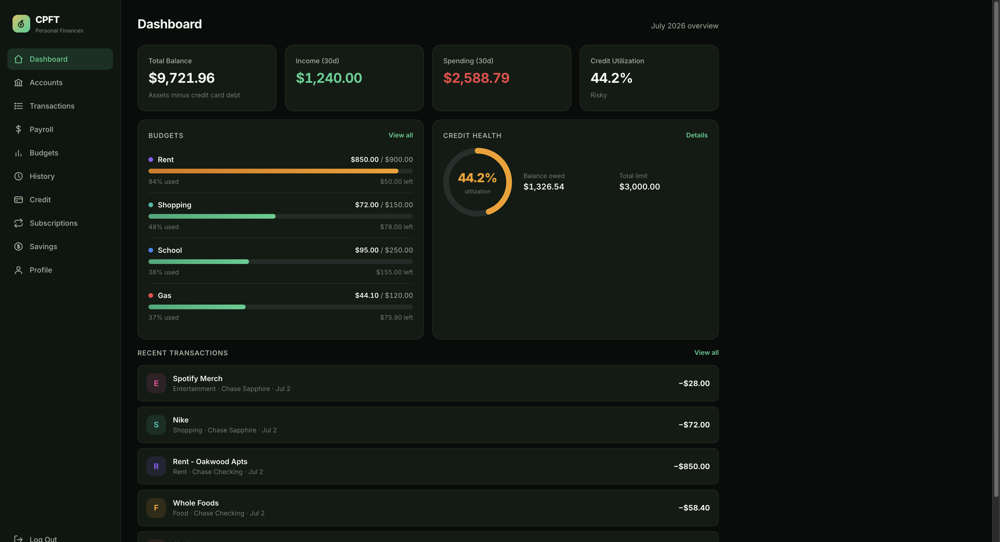
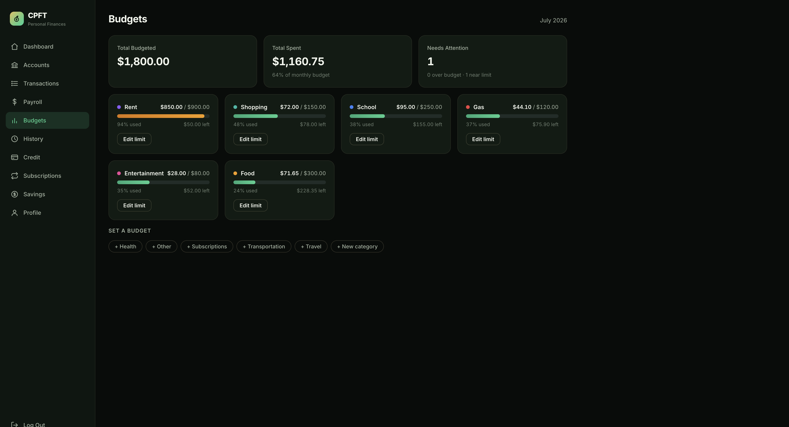
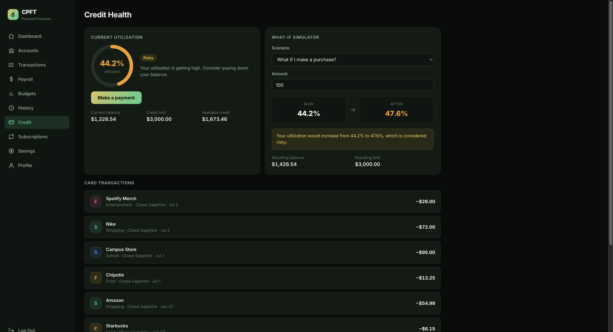
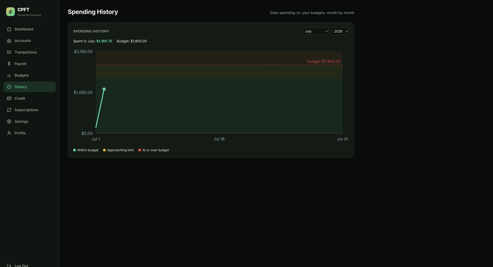
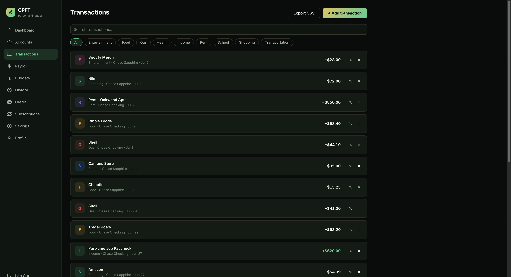
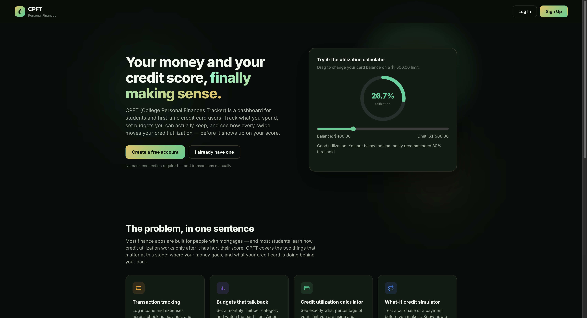

# CPFT — College Personal Finances Tracker

A full-stack personal finance and credit-health dashboard built for students,
young adults, and first-time credit card users. Track what you spend, set budgets
you can actually keep, and see how every swipe moves your credit utilization —
before it shows up on your score.

---

## Demo

A ~2-minute walkthrough of the whole app: [**demo.mp4**](demo.mp4)

<!-- GitHub shows an inline player for the committed video on the file page.
     To embed an autoplaying player directly in this README, open the README
     in GitHub's web editor and drag demo.mp4 into it. -->

[](demo.mp4)

> Click the image above (or open [`demo.mp4`](demo.mp4)) to watch the tour.

### Screens

| Dashboard | Budgets |
| --- | --- |
|  |  |

| Credit Health | Spending History |
| --- | --- |
|  |  |

| Transactions | Landing |
| --- | --- |
|  |  |

---

## Features

- **Accounts** — checking, savings, credit cards, cash, and investments. Add,
  rename, adjust balances, or close an account; balances update automatically as
  transactions post.
- **Transactions** — log income and expenses, search and filter by category,
  edit or delete entries (with automatic balance reversal), and export to CSV.
- **Budgets** — set a monthly limit per category and watch the bar fill up
  (green → amber at 80% → red when over). Custom categories and automatic
  rollover of last month's limits.
- **Spending History** — a per-month line chart of daily spending against your
  budget, with color-coded zones for within / approaching / over budget.
- **Credit Health** — a live utilization ring, plain-English risk guidance, a
  what-if simulator (test a purchase or payment before you make it), and a
  guided flow to pay down a card from any bank account.
- **Subscriptions** — recurring charges post automatically each billing cycle
  and adjust the paying account; pause or resume any subscription.
- **Savings** — automate weekly or monthly transfers from a source account into
  savings; transfers are recorded and balances updated on schedule.
- **Payroll** — track recurring income.
- **Accounts, security & polish** — email/password auth with bcrypt + signed
  JWTs, per-IP rate limiting on auth endpoints, session-expiry auto-logout,
  security headers, strict CORS, and a fully responsive UI (desktop sidebar,
  mobile bottom tab bar with a "More" sheet).

See [`docs/database-design.md`](docs/database-design.md) for the full ERD and
database design.

---

## Tech Stack

- **Backend:** FastAPI, SQLAlchemy, PostgreSQL (SQLite for local dev), Alembic,
  Pydantic, python-jose (JWT), bcrypt, pytest
- **Frontend:** React, TypeScript, Vite, React Router
- **Infra:** Docker Compose for local, Render + Vercel for production

## Project Structure

```
CPFT/
├── demo.mp4                  # Product walkthrough video
├── docs/
│   ├── database-design.md    # ERD / database design (source of truth)
│   └── screenshots/          # README imagery
├── backend/                  # FastAPI + SQLAlchemy + PostgreSQL
│   ├── app/
│   │   ├── main.py           # FastAPI entry point (CORS, security headers)
│   │   ├── config.py         # Settings (env-driven)
│   │   ├── database.py       # Engine / session setup
│   │   ├── models/           # SQLAlchemy models
│   │   ├── schemas/          # Pydantic request/response models
│   │   ├── services/         # Business logic (auth, etc.)
│   │   └── routers/          # API endpoints (auth, finance)
│   ├── alembic/              # Migration environment
│   ├── tests/                # pytest suite (balance math, date logic)
│   └── requirements.txt
├── frontend/                 # React + TypeScript + Vite
│   └── src/
│       ├── api/              # Typed API client (auth, finance)
│       ├── components/       # Reusable UI (charts, list items, icons)
│       └── pages/            # Dashboard, Accounts, Transactions, Budgets,
│                             #   History, Credit, Subscriptions, Savings, ...
├── docker-compose.yml
└── render.yaml               # One-click Render blueprint (API + Postgres)
```

---

## Running Locally

### Option A — Docker (everything at once)

```bash
docker compose up --build
```

App: http://localhost:5173 · API: http://localhost:8000

### Option B — Run each service manually

**Backend**

```bash
cd backend
python3 -m venv .venv
source .venv/bin/activate
pip install -r requirements.txt
uvicorn app.main:app --reload
```

By default the backend uses a local SQLite file (`cpft_dev.db`) so it starts
without PostgreSQL. To use Postgres, copy `.env.example` to `.env` and set
`DATABASE_URL`.

- API docs (dev only): http://localhost:8000/docs
- Health check: http://localhost:8000/health

**Frontend**

```bash
cd frontend
npm install
npm run dev
```

Open http://localhost:5173. Set `VITE_API_URL` if the API is not on
`http://localhost:8000`.

### Migrations

Alembic is configured and the current schema is stamped as the baseline. After
changing any model:

```bash
cd backend
.venv/bin/alembic revision --autogenerate -m "describe the change"
.venv/bin/alembic upgrade head
```

### Tests

```bash
cd backend
.venv/bin/python -m pytest tests/
```

---

## Deploying to Production

Set these environment variables on the backend host:

| Variable | Value |
| --- | --- |
| `ENVIRONMENT` | `production` (hides /docs, enables HSTS, enforces the checks below) |
| `SECRET_KEY` | a long random string — the API **refuses to start** with the default |
| `DATABASE_URL` | your managed Postgres URL |
| `FRONTEND_BASE_URL` | your deployed frontend URL (only this origin may call the API) |

Then:

1. `alembic upgrade head` against the production database
2. Frontend: `npm run build` and serve `dist/` (set `VITE_API_URL` to the API URL at build time)
3. Serve the API behind HTTPS (HSTS is sent automatically in production)

A [`render.yaml`](render.yaml) blueprint is included to provision the API and a
Postgres instance on Render; the frontend deploys cleanly to Vercel via
[`frontend/vercel.json`](frontend/vercel.json).

Already built in: bcrypt password hashing, signed JWTs with 24h expiry, per-IP
rate limiting on auth endpoints, security headers, strict CORS, and
parameterized queries via SQLAlchemy.

---

## Build Phases

1. **Foundation** — users, auth, financial accounts, categories
2. **Personal finance** — transactions, budgets, subscriptions, dashboard
3. **Credit health** — credit profiles, simulations, utilization logic
4. **Smart features** — insights, alerts, rule-based recommendations
5. **Optional** — goals, income sources, audit logs, Plaid, CSV upload
